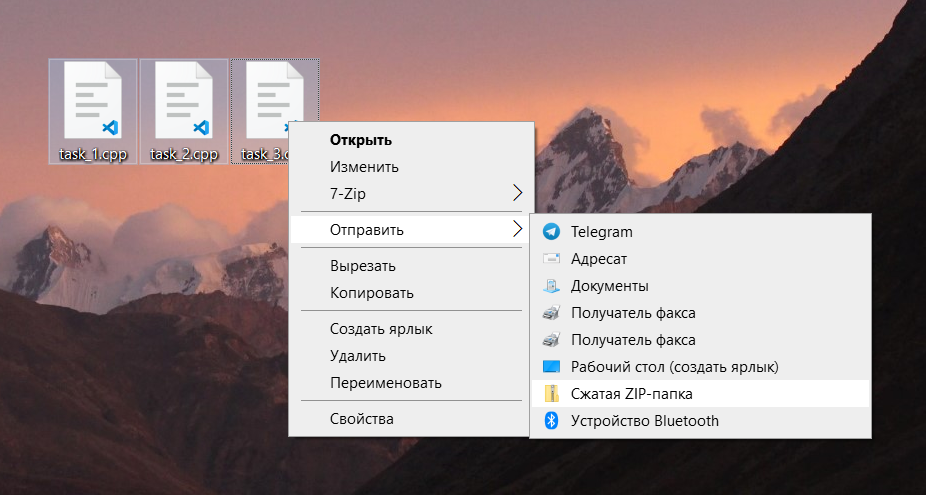
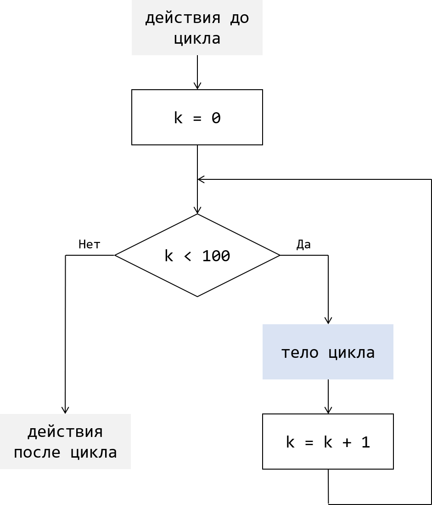
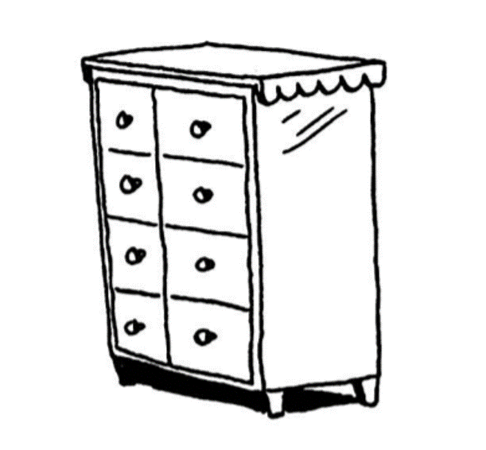
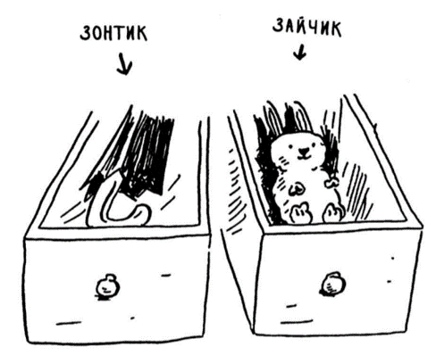
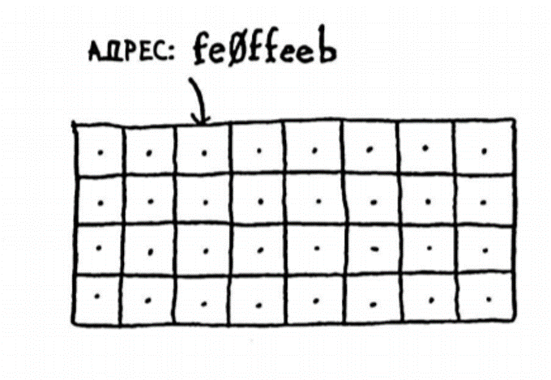
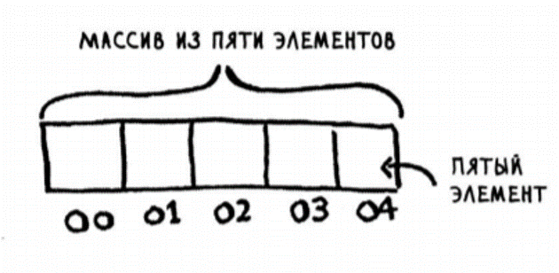

[TOC]

### Цели курса

- Научиться концентрировать внимание
  - Внимательно слушать
  - Повторять пройденное
  - Выполнять задания на уроке
- Узнать основы программирования, которым учится **любой** начинающий программист
  - Внимательно слушать
  - Задавать вопросы
  - Выполнять задания на дом


### Правила выполнения и отправки домашних заданий

##### Сроки

На выполнение домашнего задания выделяется 10 дней со дня выдачи. Желательно сделать домашнее задание как можно скорее, чтобы скорее узнать свою оценку. Тогда вы успеете переделать домашнее задание, если вам не понравится оценка, а также прочитать комментарий преподавателя или задать вопрос преподавателю по поводу домашнего задания.

##### Файлы с напоминаниями

Домашние задания необходимо выполнять, чтобы за неделю не забыть пройденное и не потерять знания. Перед выполнением домашнего задания рекомендуется прочитать PDF файл-напоминание по пройденной теме, чтобы вспомнить пройденное и не наделать ошибок при решении задач из домашней работы. Повторение пройденного и выполнение домашних заданий позволит вам приходить на занятия в готовности.

##### Именование файлов

При решении задач по программированию вы будете писать программы в файлах в формате `.cpp` или `.c++`. Каждую задачу следует решать в отдельном файле. Файлы необходимо называть понятным образом, в соответствии со смыслом задания или просто в соответствии с нумерацией задач в домашнем задании. Например, если вы решили три задачи, то называйте файлы с программами понятным образом, вот так:

`task_1`, `task_2`, `task_3`

или так:

`solution_1`, `solution_2`, `solution_3`

или так:

`problem_1`, `problem_2`, `problem_3`

Это необходимо, чтобы преподаватель при проверке домашнего задания смог понять, к какой задаче относится написанная вами программа. В ином случае преподаватель может удалить отправленное вами домашнее задание и ждать, пока вы не отправите выполненное домашнее задание с правильным именованием файлов.

##### Архивация файлов

Обычно при выполнении домашних заданий у вас будет получаться несколько файлов с программами. Чтобы отправить несколько файлов в качестве выполненного домашнего задания, их сначала необходимо выделить и поместить в архив zip (сжатая ZIP-папка), а затем отправить эту сжатую ZIP-папку.




### Работа со средой разработки Dev-C++

Давайте приступим к работе со средой программирования Dev-C++. Это программа, которая позволит создавать программы. Запустим Dev-C++. При запуске нас встречает стартовое окно программы. Нажимаем сочетание клавиш `Ctrl` + `N` чтобы **создать новый файл**. В этом файле мы будем писать код нашей программы.

Любая программа на С++ начинается с написания шапки программы. Шапка программы выглядит похожим образом для всех программ:

```c++
#include <iostream>
using namespace std;

int main() {
    
    
    return 0;
}
```

Это пустая программа, которая ничего не делает. Можно разобраться, что означают эти строчки.

В первой строке за словом `#include` указывается библиотека. Компьютер не знает какие команды использовать. Команды он читает из библиотек, их большое множество, а в нашем случае нам понадобятся библиотека `iostream`. Для работы программы на языке С++ нужно указать точную область команд путем команды `using namespace std;` она помогает языку программирования найти нужную команду.

Далее написана функция `int main () {}` — это главная функция, весь код мы будем писать внутри этой функции, между символами `{ }` (фигурные скобки). Фигурные скобки — это **ограничитель блока кода**, в том числе ограничитель тела функции. Внутри функции `main` лишь одна команда — `return 0;` которая нужна нам для корректного завершения работы программы.

Важно иметь ввиду что любая команда должна заканчиваться символом `;` (точка с запятой). Если вы будете забывать ставить окончание команды, то программа не запустится и будет выдавать ошибки.

Мы будем использовать три разных вида скобок:

`( )` — круглые

`{ }` — фигурные

`[ ]` — прямоугольные


### Вывод чисел и текста на экран с помощью `cout <<`

У программистов есть традиция, согласно которой, когда они учат новый язык программирования, они пишут самую первую программу — *Hello, World! (англ. Привет, мир!)*

Давайте попробуем написать её на языке С++.

Итак, наша программа должна будет вывести фразу *Hello, World!* на экран. Для того чтобы выводить слова на экран, мы используем команду `cout <<`. Образно говоря, `cout <<` — это команда *"сказать"*.

*Hello, World!* — это строка. При выводе строки на экран будем заключать текст строки́ в **двойные кавычки**. Значит, нам нужно написать в команде вывода `"Hello, World!"`.

*Программа примет такой вид*

```c++
#include <iostream>
using namespace std;

int main() {
    cout << "Hello, World!";
    
    return 0;
}
```

Образно говоря, мы даём компьютеру команду *"Скажи Hello, World!"*

Вся строка пишется между двойными кавычками. Например, вывод предложения *I hope, that I will have 12 points, because I'am writing a lot of words, and I know English* будет выглядеть в коде программы так: 

```c++
cout << "I hope, that I will have 12 points, because I'am writing a lot of words, and I know English";
```


Также с помощью команды `cout <<`  можно вывести на экран число или несколько чисел и строк:

```c++
cout << "I hope, that I will have " << 12 << " points, because I'am writing a lot of words, and I know English";
```

Обратите внимание, здесь число `12` выводится **не как текст**, а **как число**, и вставляется между двумя кусками предложения.


##### Переход на новую строку с помощью `endl`

Теперь попробуем разместить четверостишье:

```
The leaves are falling
One by one
Summer's over
School's begun
```

Для того чтобы это сделать, нам нужно реализовать переход на новую строку. На английском конец это — *end*, а линия это — *line*, вместе end+line дают команду `endl`. `endl` — это команда, которая завершает строку и ставит перенос на следующую строку. Эта команда будет использоваться вместе с командой вывода `cout <<`.

Это будет выглядеть так:

```c++
cout << "The leaves are falling" << endl;
cout << "One by one" << endl;
cout << "Summer's over" << endl;
cout << "School's begun" << endl;
```


##### Работа с русским языком с помощью `setlocale`

Если вы попробуете вывести текст на русском, то он заменит ваши буквы на непонятные символы. Для того чтобы текст на русском языке отображался корректно, мы должны добавить следующую строку сразу внутри функции `main()`:

```c++
setlocale(0, ”rus”);
```

Тогда программа будет выглядеть так:

```c++
#include <iostream>
using namespace std;

int main() {
    setlocale(0, "rus");
    cout << "Привет!" << endl;
    
    return 0;
}
```


### Переменные

Переменная — это специальный объект в программе, который может хранить изменяемую информацию. Переменные предназначены для хранения изменяемых значений. Переменных может быть много в одной программе. У любой переменной есть своё **имя**, которое мы задаём при создании этой переменной. Создание переменных называется **объявлением**.

Помимо уникального **имени**, любая переменная в языке C++ должна иметь явно указанный **тип** данных, для хранения которых она предназначена. Старайтесь давать переменным имена со смыслом, чтобы можно было бы понять, для чего предназначена конкретная переменная.


#### Основные типы переменных

`int` для **целых чисел**, например, `-3`, `-2`, `-1`, `0`, `1`, `2`, `3`

`double` для **дробных чисел**, например, `1.4`, `5.25`, `6.0`, `96.2675`

`char` для **символов**, например, `'a'`, `'b'`, `'1'`, `'5'`, `'!'`, `'.'`

`bool` для **логических значений**, например, `true`, `false`


#### Тип переменных `int` для хранения целых чисел

Для хранения **целых чисел** в языке C++ используются переменные типа `int`. Это важно запомнить, мы будем часто пользоваться переменными такого типа.

Объявление (создание) переменных для программы будем делать внутри `main` следующим образом:

```c++
#include<iostream>
using namespace std;

int main() {
    int a;
    return 0;
}
```

Здесь сначала указывается **тип переменной** — это `int`. Затем через пробел указывается **имя переменной** — в нашем случае это `a`. Затем ставится точка с запятой, это окончание команды объявления переменной.

Если нам необходимо создать несколько переменных (например, переменные с именами `a`, `b` и `c`), то можно сделать это одним из следующих способов:

*вот так*

```c++
int a;
int b;
int c;
```

*или вот так*

```c++
int a, b, c;
```

В первом случае мы использовали три команды для объявления трёх переменных по очереди, друг за другом. Во втором случае мы с помощью одной команды объявили сразу три переменные.

Теперь попробуем придать нашим переменным некоторые значения (так как переменные предназначены для хранения некоторых изменяемых значений). Для этого будем использовать операцию `=` (знак равно). В языке C++ это делается следующим образом:

```c++
a = 6;
b = 100;
c = 78;
```

Эта операция называется **присваиванием**. Мы присвоили переменной `a` значение `6`, переменной `b` — значение `100`, переменной `c` — значение `78`.

Присвоить некоторое значение переменной возможно только после её объявления.


Присваивание значения переменной можно сделать **прямо во время её объявления**. Это называется **инициализацией**. Вот так это делается:

```c++
int a = 6;
int b = 100;
int c = 78;
```

Можно сделать это и вот так:

```c++
int a = 6, b = 100, c = 78;
```

Переменной можно присвоить не только какое-то постоянное значение. Давайте попробуем присвоить переменной значение **из другой переменной**. ==Когда мы обращаемся к переменной по имени (упоминаем её имя), то мы получаем значение, которое она хранит.==

После того, как мы объявили переменную a и присвоили ей некоторое значение, попробуем написать следующее:

```c++
int d;
d = a;
```

Теперь переменная `d` хранит то же самое значение, что и переменная `a`.

==Переменной можно присваивать и результат выполнения какого-то выражения.== После того как мы объявили переменные `a`, `b`, `c` и присвоили им некоторые значения в виде чисел, попробуем написать следующее:

```c++
int d;
d = a + b + c;
```

Теперь новая переменная `d` будет хранить целое число, полученное в результате сложения значений из переменных `a`, `b` и `c`. Это равно `184`. Попробуем вывести это значение на экран, воспользовавшись известной нам **командой вывода**, дописав это:

```c++
cout << d;
```

При запуске этой программы на экране появится число `184`. В итоге программа выглядит примерно так:

```c++
#include<iostream>
using namespace std;

int main() {
    int a, b, c;
    a = 6;
    b = 100;
    c = 78;

    int d;
    d = a + b + c;

    cout << d;

    return 0;
}
```

Мы можем реализовать и некоторые другие арифметические выражения, комбинируя операции сложения, вычитания, умножения и деления всевозможными способами. Эти выражения так же можно присвоить переменной.

**Замечание**

Следует не забывать, что в языке C++ арифметические операции имеют разный приоритет, как и в арифметике. То есть операции умножения и деления имеют более высокий приоритет, чем операции сложения и вычитания.


#### Арифметические операции

Сложение

```c++
int a = 5;
int b = 7;
int c = a + b;
int d = 4 + b;
```

Вычитание

```c++
int a = 5;
int b = 7;
int c = a - b;
int d = b - 3;
```

Умножение

```c++
int a = 5;
int b = 7;
int c = a * b;
int d = b * 3;
```

Деление

```c++
int a = 5;
int b = 7;
int c = b / a;
double d = 22.5 / 4;
```

Остаток от деления

```c++
int a = 5;
int b = 7;
int c =  b % a;
int d = 22 % 4;
```


Изменить порядок следования арифметических операций можно с помощью круглых скобок `()`.

Попробуем реализовать математическое выражение, которое сочетает в себе четыре известные нам операции. Необходимо также сохранить результат вычисления выражения в некоторую переменную и вывести значение этой переменной на экран.

*Выражение следующее:*
$$
d=\frac{a+b \times a+5689}{c \times(7-3)} \times (a-3) \times b
$$

Если значения для переменных `a`, `b`, `c` задаются заранее, тогда программа для подсчёта такого выражения будет выглядеть примерно так:
```c++
#include<iostream>
using namespace std;

int main() {
    int a, b, c;
    a = 6;
    b = 100;
    c = 78;

    int d;
    d = ((a + b * a + 5689) / c * (7 - 3)) * (a - 3) * b;
    
    cout << d;
    return 0;
}
```

Следует обратить внимание, что в качестве результата мы получим целое число, а **не дробное**, так как сейчас мы работаем только с переменными типа `int`, которые хранят целые значения.

Как может получиться дробное число? Например, число $\frac{5}{2}=2.5$ **не является целым**, оно является **дробным числом**. Если мы попробуем записать это выражение в переменную типа `int` (которая хранит только целые числа), то в этой переменной окажется не `2.5`, а только `2`.

Вот такой фрагмент программы
```c++
int result;
result = 5 / 2;
cout << result;
```
выведет число `2`. Важно обратить на это внимание и запомнить. Как сохранять дробные числа мы узнаем, когда познакомимся с другими типами переменных в языке программирования C++.


#### Тип переменных `double` для хранения дробных чисел

Ранее мы познакомились с типом `int` для переменных. Переменная типа `int` позволяет хранить целое число, то есть число вида …, -3, -2, -1, 0, 1, 2, 3, … .

Теперь мы готовы узнать новый тип `double` для переменных в языке C++. Переменная типа `double` позволяет хранить **дробное число** — десятичную дробь. Стоит отметить, что переменная типа `double` может хранить также и целое число, но для программы оно будет являться дробным.

**Дробные числа или десятичные дроби — это числа вроде** `2.5` **или** `3.14`**. То есть это такие числа, у которых помимо целой части есть дробная часть, которая записывается после точки.**

Способ создания переменной типа `double` схож со способом объявления переменной типа `int`. Сначала указывается **тип переменной**, а затем её **имя**.

*Рассмотрим пример*

```c++
#include<iostream>
using namespace std;

int main() {
    double a, b, result;
    a = 5;
    b = 2;
    result = a / b;
    cout << result;
    return 0;
}
```

Эта программа сохранит в переменную `result` результат деления значения переменной `a` на значение переменной `b` и выведет его на экран. Получится число `2.5`.

Если бы мы использовали здесь тип переменной `int` вместо `double`, то результатом работы такой программы было бы число `2`, вместо `2.5`. Это случилось бы, так как переменные типа `int` хранят только целые числа, а `2` — это целое число.

**Арифметические операции с переменными типа** `int` **в качестве результата дают только целочисленные значения (целые числа, а не дробные).**

В случае с делением достаточно, чтобы **хотя бы одна** из переменных, участвующих в делении, хранила дробное значение. Тогда результатом такого деления будет также дробное значение.


Мы можем напрямую присваивать переменной типа `double` дробное значение (десятичную дробь). Например, внутри кода программы можно написать так:

```c++
double number_1, number_2, number_3;
number_1 = 3.14;
number_2 = 53.0;
number_3 = 37;
```

В этом примере число `3.14` — это дробная постоянная (десятичная дробь). Мы присвоили значение `3.14` переменной с именем `number_1`. Переменная `number_1` имеет тип `double`, поэтому она может хранить дробное значение — присваивание в примере корректно. Аналогично с присваиванием для переменных `number_2` и `number_3`.

Помимо того, если мы имеем некоторую переменную типа `int`, то мы можем присвоить её значение переменной типа `double`. Оно будет преобразовано в тип `double`.

*Посмотрим на пример*

```c++
int number_1;
double number_2;
number_1 = 5;
number_2 = number_1;
cout << number_2;
```

Программа из этого примера выведет на экран число `5`.

Похожим образом, если у нас имеется переменная типа `double`, то мы можем присвоить её значение переменной типа `int`. Важно отметить, что эта операция присваивания **отбросит дробную часть**, которая была у переменной типа `double`, так как `int` может хранить только целое число.

*Пример*

```c++
double number_1;
int number_2;
number_1 = 78.489;
number_2 = number_1;
cout << number_2;
```

Программа из этого примера выведет на экран число `78`, так как дробная часть `.489` будет отброшена при присваивании `number_2 = number_1`.


#### Тип переменных `char` для хранения символов

Все пройдённые ранее типы переменных (`int`, `double`) были предназначены для хранения чисел. В C++ есть специальный тип переменных для хранения символов. Символы — это знаки, буквы и цифры. Важно отличать числа от цифр. Числа — это объекты из математики, с которыми можно выполнять математические операции. В текстовом представлении числа состоят из цифр. **Таким образом, цифры это лишь значки, которые используются для записи чисел.**

Символы в C++ записываются в одинарных кавычках. Например, `'a'` или `'4'`.

Следующая программа после запуска выведет в консоль символ `'a'`:

```c++
#include<iostream>
using namespace std;

int main() {
    char symb;
    symb = 'a';
    cout << symb;
    
    return 0;
}
```

Здесь сначала создаётся переменная типа `char` с именем `symb`. Затем переменной `symb` присваивается значение `'a'` вот так `symb = 'a'`. После этого значение переменной `symb` выводится на экран вот так `cout << symb`.


Мы также можем вывести запись `Hello, World!`, выводя отдельные символы этой строки.

```c++
#include<iostream>
using namespace std;

int main() {
    char c1, c2, c3, c4, c5, c6, c7, c8, c9, c10;
    c1 = 'H';
    c2 = 'e';
    c3 = 'l';
    c4 = 'o';
    c5 = ' ';
    c6 = ',';
    c7 = 'W';
    c8 = 'r';
    c9 = 'd'; 
    c10 = '!';
    
    cout << c1 << c2 << c3 << c3 << c4 << c6 << c5 << c7 << c4 << c8 << c3 << c9 << c10 << endl;

    return 0;
}
```

Здесь сначала создаются переменные типа `char` с именами `c1`, `c2`, `c3`, `c4`, `c5`, `c6`, `c7`, `c8`, `c9`, `c10`, которым присваиваются соответственно указанные значения. После чего значения этих переменных выводятся на экран с помощью `cout <<` в определённом порядке. В результате на выходе получается строка *Hello, World!*


###### Коды символов `char`

У каждого символа `char` есть свой **код** в виде числа. Так как для хранения **целого числа** в C++ используется переменная типа `int`, то чтобы узнать код символа, достаточно присвоить этот символ переменной типа `int`. Все символы в системе находятся в кодовой таблице и следуют друг за другом.

Например, код символа `'A'` в кодовой таблице равен `65`. Можно проверить это следующим образом:

```c++
char symbol_A = 'A';
int code_A = symbol_A;
 
cout << code_A << endl;
```

Данный кусочек программы выведет число `65`.

Мы можем выполнять с кодами символов такие же математические операции, как и с просто числами. Например, если прибавить число `5` к символу `'A'`, то мы получим символ, равный шестому символу в алфавите, то есть букву `'F'`.

Например, такой фрагмент программы

```c++
char symb = 'A' + 5;
cout << symb;
```

выведет на экран букву `'F'`.


### Считывание чисел и символов с помощью `cin >>`

До сих пор мы задавали значения переменных ещё **до запуска программы**.

**После запуска программы мы уже никак не могли влиять** на итоговый результат, который программа выдавала. Это происходило, так как все значения для переменных в формулах были **заранее определены** при написании кода программы. Сколько бы раз мы не запускали подобную программу, она **всегда выдавала бы одинаковый результат**.

*Например:*

```c++
#include<iostream>
using namespace std;

int main() {
    int number_1, number_2, number_3;
    number_1 = 60;
    number_2 = number_1 + 20;
    number_3 = number_2 * 3;

    cout << number_3;
    return 0;
}
```

Такая программа всегда будет выводить на экран один и тот же результат своей работы. Это будет число `240`. Мы могли запустить её сколько угодно раз, но результат не поменялся бы, пока мы не поменяли бы код внутри программы, не задав переменным другие значения прямо в коде программы. Это потребовало бы изменять программу.


На предыдущих занятиях мы узнали о команде, которая позволяла программе выводить (печатать) числа или текст изнутри программы на экран. Это была команда `cout <<`. 

Теперь мы познакомимся с новой командой `cin >>`, которая **позволит программе считывать и запоминать (сохранять в переменные) значения, которые можно будет ввести с клавиатуры уже после запуска программы**. Это означает, что в таком случае значения для переменных не будут задаваться заранее.

В предыдущем примере значение переменной `number_1` всегда **известно заранее** внутри программы. Попробуем переписать предыдущий пример так, чтобы значение для переменной `number_1` **не было известно программе заранее**. Используем для этого новую для нас команду `cin >>`.
```c++
#include<iostream>
using namespace std;

int main() {
    int number_1, number_2, number_3;

    cin >> number_1;

    number_2 = number_1 + 20;
    number_3 = number_2 * 3;

    cout << number_3;

    return 0;
}
```

Смотрите, теперь вместо присваивания `number_1 = 60` мы видим использование новой команды `cin >> number_1` для считывания с клавиатуры. Получается, теперь в программе заранее не записано значение переменной `number_1`.

Важно помнить, что после запуска код программы будет выполняться одна команда за другой, строчка за строчкой, по очереди (так же, как это было в блок-схемах).

Попробуйте запустить эту программу. После запуска она ничего не выведет на экран, она остановится на команде `cin >> number_1` для считывания с клавиатуры в переменную `number_1`. **Команда** `cin >>` **ожидает, пока вы введёте какое-то число с помощью клавиатуры уже после запуска программы, чтобы записать это значение в переменную, которая записана справа от команды** `cin >>`**.** В нашем случае это переменная `number_1`.

Теперь, когда вы запустили программу, она ждёт, когда вы напишете какое-то число, чтобы она смогла сохранить его в переменную `number_1` и продолжила работу. Во время работы программы попробуйте ввести какое-то число и нажать кнопку `Enter`. После этого программа перейдёт к выполнению следующих команд и дойдёт до команды вывода на экран `cout << number_3`. Теперь программа напечатает на экране результат своей работы, прежде выполнив арифметические операции с тем числом, которое вы ввели.

**Теперь программа может выводить различные результаты в зависимости от тех данных, которые вы введёте во время её работы.**

*Пример задачи*

Написать программу, которая после запуска считывает одно число с клавиатуры, а затем выводит число предыдущее перед ним и число следующее после него. То есть, если я введу число `8`, то программа должна будет напечатать число `7` и число `9`. Если от введённого числа отнять единицу, то получится предыдущее перед ним. Если прибавить единицу, получится следующее.

```c++
#include<iostream>
using namespace std;

int main() {
    int num;
    cout << "Введите число: ";
    cin >> num;
    cout << "Предыдущее число это " << num - 1 << endl;
    cout << "Следующее число это " << num + 1;
    return 0;
}
```

После запуска программы из этого примера будет напечатана строка, которая объясняет, чего хочет программа. Это строка `"Введите число: "`. Введите любое число (например, `56`) ПРЯМО В ЧЁРНОМ ОКОШКЕ и нажмите `Enter`. Программа выведет ещё две строчки с результатом работы:

```
Предыдущее число это 55
Следующее число это 57
```

Это и требовалось в условии задачи.


С помощью команды `cout >>` вывода информации мы могли выводить несколько строк или значений на экран вот так:

```c++
int num_1, num_2;
double num_3;

num_1 = 5;
num_2 = 76;
num_3 = 51.98;

cout << "Вот какие-то числа: " << endl << num_1 << ", " << num_2 << ", " << num_3 << endl << "Это всё.";
```

Эта программа выведет следующее:
```
Вот какие-то число:
5, 76, 51.98
Это всё.
```

Подобным образом мы можем использовать команду `cin >>` для считывания значений с клавиатуры сразу для нескольких переменных.

*Например*

```c++
int num_1, num_2;
double num_3;

cin >> num_1 >> num_2 >> num_3;

cout << "Вот введённые числа: " << endl << num_1 << ", " << num_2 << ", " << num_3 << endl << "Это всё.";
```

Обратите внимание, что теперь вместо ранее используемых присваиваний

```c++
num_1 = 5;
num_2 = 76;
num_3 = 51.98;
```

мы написали строку

```c++
cin >> num_1 >> num_2 >> num_3;
```

которая ждёт, пока пользователь введёт три числа, а затем сохраняет введённые числа в переменные `num_1`, `num_2` и `num_3`. Напоминаю, что после ввода каждого числа в чёрном окошке нужно ставить пробел, либо нажимать `Enter`, чтобы программа поняла, что вы уже закончили вводить это число.


### Оператор проверки истинности (условия) `if`

До сих пор наши программы были **линейны** — то есть содержали набор действий (команд), которые выполнялись друг за другом в любом случае и независимо от каких-либо условий.

Давайте вспомним первое занятие, на котором мы проходили блок-схемы. В блок-схемах мы могли использовать специальную фигуру **ромб**, когда нам было необходимо проверить некоторое условие и, в зависимости от его правдивости, выполнить одно из двух действий.

Внутри ромба мы вписывали вопрос, на который можно ответить *"да"* либо *"нет"*. Соответственно, после проверки условия, некоторые действия выполнялись, а некоторые пропускались. Такие алгоритмы не являлись линейными, так как из-за проверки условия не все действия могут быть выполнены.

**В языке C++ для проверки условия мы будем использовать специальную команду, которая называется условным оператором** `if`**.** Слово *"if"* переводится с английского языка как *"если"*.

На самом деле мы каждый день неосознанно используем такой оператор в жизни. Например, *если я дам продавцу больше денег, чем должен, то он вернет мне сдачу*. Или, *если я получу пятерку в школе, то я буду рад*.

*Пример*

Давайте попробуем реализовать программу для последнего примера: если я получу 5, то я буду рад. Итак, в первую очередь пользователь должен сообщить программе свою оценку. С прошлых уроков нам известно, что для считывания чисел с клавиатуры нужно использовать функцию `cin >>`.

```c++
int mark;
cout << "Какую оценку ты получил?" << endl;
cin >> mark;
```

Здесь с помощью команды `cout <<` выводится текст `"Какую оценку ты получил?"`. Затем с помощью команды `cin >>` программа ожидает, когда пользователь введёт некоторое число-оценку. Для хранения оценки будем использовать переменную `mark`. Когда пользователь введёт число и нажмёт `Enter`, то команда `cin >>` запомнит введённое значение в переменную `mark`.

Теперь нам нужно объяснить программе на языке C++, что если человек ввел число `5`, то нужно вывести сообщение `"Я рад"`. Для этого будем использовать оператор `if`:

```c++
if (mark == 5) {
    cout << "Я рад";
}
```

Здесь проверяемое условие `mark == 5` мы вписываем в круглые скобки после команды `if`. Затем открывается фигурная скобка. Внутри фигурных скобок записываются команды-действия, которые должны быть выполнены при правдивости выражения `mark == 5`.

Всё вместе можно прочитать словами как: *если значение переменной `mark` равно `5`, тогда вывести строку `"Я рад"`*.


Если запустим программу, то мы увидим текст:

```
Какую оценку ты получил?
```

После этого введём число `5` и нажмём `Enter`. Тогда увидим следующее:

```
Какую оценку ты получил?
5
Я рад
```

Давайте теперь добавим условия, при выполнении которых будет выводиться другой текст, если пользователь введёт другую оценку:

```c++
if (mark == 5) {
    cout << "Я рад";
}
if (mark == 4) {
    cout << "Ты очень хорошо поработал";
}
if (mark == 3) {
    cout << "В следующий раз старайся больше";
}
if (mark == 2) {
    cout << "Видимо, что-то пошло не так";
}
```
Теперь программа будет работать и для других оценок. Подумайте, что она выведет, если вводить в неё разные числа. Попробуйте переписать её и запустить.

*Программа целиком*

```c++
#include <iostream>
using namespace std;

int main() {
	int mark;
    cout << "Какую оценку ты получил?" << endl;
    cin >> mark;
    
    if (mark == 5) {
    	cout << "Я рад";
    }
    
    if (mark == 4) {
        cout << "Ты очень хорошо поработал";
    }
    
    if (mark == 3) {
        cout << "В следующий раз старайся больше";
    }
    
    if (mark == 2) {
        cout << "Видимо, что-то пошло не так";
    }
    
	return 0;
}
```


#### Использование `else`

**Оператор** `else` **используется, если в программе необходимо выполнить определённый кусочек кода только в том случае, если проверяемое в условии `if` логическое выражение оказалось ложным.** С английского языка *"else"* переводится как *"иначе"*.

Важно понимать, что `else` используется только вместе с конкретным оператором `if`.

*Пример 1*

Напишем программу, которая считывает два числа, сравнивает два введённых числа и выводит на экран большее из них. В случае, если два числа равны, то программа должна вывести соответствующий текст.

```c++
#include <iostream>
using namespace std;

int main() {
	int number_1, number_2;
	cout << "Введите два числа: ";
	cin >> number_1 >> number_2;

	if (number_1 > number_2) {
		cout << number_1 << " больше";
	}
	else if (number_1 < number_2) {
		cout << number_2 << " больше";
	}
	else {
		cout << number_1 << " равно " << number_2;
	}
    
	return 0;
}
```

Первое `else` здесь относится к условию `if (number_1 > number_2)`, а второе `else` относится ко второму условию `if (number_1 < number_2)`. Разберём, что происходит в этой программе.

Сначала объявляются две переменные для хранения целых чисел

```c++
int number_1, number_2;
```

выводится строка `"Введите два числа: "`, которая как бы предлагает ввести два числа

```c++
cout << "Введите два числа: ";
```

команда `cin >>` ожидает, когда пользователь введёт два числа с клавиатуры, а затем сохраняет эти введённые числа в ранее созданные переменные `number_1` и `number_2`

```c++
cin >> number_1 >> number_2;
```

проверяется первое условие

> если `number_1` больше, чем `number_2`

и, если это правда, на экран выводится значение переменной `number_1` с текстом `" больше"`

```c++
if (number_1 > number_2) {
	cout << number_1 << " больше";
}
```
теперь следует `else`, то есть блок кода, который выполнится иначе — **в случае ложности выражения, проверяемого первым условием**. И тут же после `else` следует новая проверка условия с помощью `if`. Читается как

> иначе, если `number_1` меньше `number_2`, тогда вывести  на экран значение переменной `number_2` и строку `" больше"`

```c++
else if (number_1 < number_2) {
	cout << number_2 << " больше";
}
```
и наконец снова следует `else`, который тоже означает **иначе**, то есть если выражение, проверяемое в предыдущем `if`, **ложно**. Выполнится соответствующий блок кода, который следует после этого `else`

```c++
else {
	cout << number_1 << " равно " << number_2;
}
```


#### Вложенные условия


Вложенные условия могут использоваться, если в программе необходимо проверить выполнение нескольких условий одновременно, и произвести действия только в случае выполнения **всех** этих условий.

*Пример 2*

Напишем программу, которая определяет благоприятность нахождения на улице в зависимости от температуры. Программа принимает температуру в качестве входного значения. Благоприятной будем считать температуру от 18 до 30 градусов.

```c++
#include <iostream>
using namespace std;

int main() {
    setlocale(LC_ALL, "rus");
    
    double temperature;
    cout << "Введите температуру на улице: ";
    cin >> temperature;
    
    if (temperature >= 18) {
        if (temperature < 25) {
            cout << "Это очень комфортно";
        }
        else if (temperature <= 30) {
            cout << "Это достаточно комфортно";
        }
        else {
            cout << "Это слишком жарко";
        }
    }
    else {
        cout << "Это слишком холодно";
    }
    
    return 0;
}
```

Таким образом, мы поместили блоки кода в другой блок кода и получили вложенность.

Обратите внимание на порядок следования фигурных скобок `{` и `}`. Каждая открывающая фигурная скобка всегда имеет свою закрывающую пару. Обратите внимание на отступы. Отступы больше там, где глубже вложенность условий и вложенность выполняемого кода.


### Логические выражения

Логическое выражение это запись, которая может быть **истиной** или **ложью**.

#### Операторы сравнения

Среди изучаемых нами простейших логических выражений следующие:

| Выражение | Значение или вопрос     |
| --------: | :---------------------- |
|    `true` | истина                  |
|   `false` | ложь                    |
|  `a == b` | `a` равняется `b`?      |
|  `a != b` | `a` не равняется `b`?   |
|   `a > b` | `a` больше `b`?         |
|   `a < b` | `a` меньше `b`?         |
|  `a >= b` | `a` не меньше `b`?      |
|  `a <= b` | `a` не превосходит `b`? |

На каждый из вопросов можно ответить *"да"* или *"нет"*.

Записи `==`, `!=`, `>`, `<`, `>=`, `<=` называются **операторами сравнения**, `a` и `b` называются **операндами**. Операнды могут быть переменными либо постоянными (константами).

Обычно мы пишем такие логические выражения при проверке их истинности с помощью оператора `if`:

```c++
if (a > b) {
    /* тут будет набор действий */
}
```

Блок кода внутри фигурных скобок выполнится **только в том случае, если логическое выражение** `a > b` **будет истинным.** Для обозначения истины в языке C++ используется слово `true` или число `1`, а для обозначения лжи используется слово `false` или число `0`.

Попробуем вывести на экран значение логического выражения `a > b`, перед этим присвоив переменным значения `a = 5` и `b = 3`:

```c++
int a = 5, b = 3;
cout << (a > b);
```

На экран будет выведено `1`, то есть `true`, так как число `5` действительно больше числа `3`. Если попробовать обратить это выражение и вывести значение логического выражения `a < b`, то на экране появится число `0`, что означает `false`, так как `5 < 3` это ложь или неправда.


#### Тип `bool` для переменных

Тип `bool` для переменных в языке C++ предназначен для хранения значений `true` или `false`. Логические выражения `a == b`, `a != b`, `a > b`, `a < b`, `a >= b`, `a <= b`, `a && b`, `a || b` имеют тип `bool`. 

Переменные этого типа создаются так:

```c++
bool is_cold;
```

Как всегда, сначала указывается тип переменной `bool`, а затем указывается её имя `is_cold`.


#### Логическая операция `&&` (логическое И)

С помощью оператора `&&` в языке C++ обозначается логическое **И**.

Логическое **И** позволяет пересечь два логических выражения так, что полученное в результате новое выражение будет `true` только тогда, когда **одновременно оба** пересечённых выражения являются `true`.

| a     | b     | a && b |
| ----- | ----- | ------ |
| false | false | false  |
| false | true  | false  |
| true  | false | false  |
| true  | true  | true   |

Из таблицы видно, что результатом применения оператора `&&` к переменным `a` и `b` является значение типа `bool`, то есть `true` или `false`. Здесь `a` и `b` называются **операндами**, а `&&` называется **оператором логического И**. Для применения оператора `&&` операнды должны также иметь тип `bool`. В качестве операндов здесь могут выступать логические выражения `a == b`, `a != b`, `a > b`, `a < b`, `a >= b`, `a <= b`, `a && b`, `a || b`.

Запись `a > 5 && a < 15` читается как "`a` больше пяти **И** `a` меньше пятнадцати". Это выражение будет `true` только в случае, если число `a` одновременно больше пяти и меньше пятнадцати.

*Пример 3*

Попробуем реализовать программу из примера 2, но теперь с использованием оператора `&&`.

```c++
#include <iostream>
using namespace std;

int main() {
    setlocale(LC_ALL, "rus");
    
    double temperature;
    cout << "Введите температуру на улице: ";
    cin >> temperature;
    
    if (temperature >= 18 && temperature < 25) {
        cout << "Это очень комфортно";
    }
    else if (temperature >= 18 && temperature <= 30) {
        cout << "Это достаточно комфортно";
    }
    else if (temperature < 18) {
        cout << "Это слишком холодно";
    }
    else {
        cout << "Это слишком жарко";
    }
    
    return 0;
}
```

Сравните программы из примеров 2 и 3.


#### Логическая операция `||` (логическое ИЛИ)

С помощью оператора `||` в языке C++ обозначается логическое **ИЛИ**.

Логическое **ИЛИ** позволяет объединить два логических выражения так, что полученное в результате новое выражение будет `true`, если **хотя бы одно** из объединённых выражений является `true`.

| a     | b     | a \|\| b |
| ----- | ----- | -------- |
| false | false | false    |
| false | true  | true     |
| true  | false | true     |
| true  | true  | true     |

Операнды `a`, `b` и результат применения логического оператора `||` имеют тип `bool`. В качестве операндов здесь могут выступать логические выражения `a == b`, `a != b`, `a > b`, `a < b`, `a >= b`, `a <= b`, `a && b`, `a || b`.

Запись `a < 5 || a > 15` читается как "`a` меньше пяти **ИЛИ** `a` больше пятнадцати". Это выражение будет `true` в случаях, если число `a` меньше пяти или если число `a` больше пятнадцати.

*Пример 4*

```c++
#include <iostream>
using namespace std;

int main() {
    setlocale(LC_ALL, "rus");
    
    bool buy_cola = false;
    bool buy_water = false;
    bool buy_juice = false;
    
    cout << "Надо спастись от жажды!" << endl;
    
    cout << "Купим Coca-Cola?: " << endl;
    cin >> buy_cola;
    
    cout << "Купим воды?: " << endl;
    cin >> buy_water;
    
    cout << "Купим сок?: " << endl;
    cin >> buy_juice;
    
    if (buy_cola == true || buy_water == true || buy_juice == true) {
        cout << "Удалось спастись от жажды" << endl;
    }
    else {
        cout << "Жажда по-прежнему мучает" << endl;
    }
    
    return 0;
}
```

Для того чтобы спастись от жажды не нужно покупать все три напитка, а достаточно купить хотя бы один из них. Попробуйте переписать эту программу и запустить. В качестве значений для принятия решения программа принимает `1` или `0`.


##### Приоритеты применения логических операций `&&` и `||`

Известно, что в арифметике операции имеют различные приоритеты, то есть операции `*` и `/` более приоритетны при выполнении, чем операции `+` и `-`. Похожим образом логические операции в логике имеют приоритеты выполнения. Оператор `&&` имеет больший приоритет, чем оператор `||`.

Например, в выражении `a && b || c && d` сначала будет вычислено значение логических выражений `a && b` и `c && d`, а затем уже всего выражения `a && b || c && d`, то есть `||` выполнится после `&&`.

Другой пример: в выражении `a || b && c` сначала будет вычислено значение логического выражения `b && c`, а затем уже всего выражения `a || b && c`, то есть `||` выполнится после `&&`.

Порядок применения операторов можно изменить, если расставить скобки, как в математике. Если хотим, чтобы в последнем примере сначала вычислялось выражение `a || b`, то нужно переписать всё выражение вот так `(a || b) && c`.


##### Использование комментариев в коде программы

Программа выполняется последовательно, одна команда следует за другой. Если вы только начинаете программировать, спустя время можно забыть что делают некоторые строки в вашей программе. Когда вы отправляете код своей программы другому программисту, ему может быть сложно понять некоторые строки, которые вы написали. Для пояснения кода можно использовать специальные записи, которые называются **комментариями**. Комментарии выступают в качестве заметок или напоминаний внутри кода программы.

В языке C++ существуют два вида комментариев: **однострочные** и **многострочные**. Для создания однострочного комментария в коде нужно написать `//`, после чего в этой же строке написать текст комментария. Пример однострочного комментария:

```c++
cin >> number; // считывание значения для переменной number
```

Для создания многострочного комментария в коде нужно написать `/*`, затем не обязательно в этой же строке написать текст комментария, после чего обязательно написать `*/`. Пример многострочного комментария:

```c++
/* Программа написана Джоном Доу. Программа сравнивает два введённых числа и выводит большее из них */
```

Текст внутри комментария не будет прочитан компьютером и не будет выполнен. Не следует злоупотреблять комментариями.


##### Математическая операция `%` (остаток от деления)

Числа не всегда делятся друг на друга нацело. При делении одного числа на другое появляется целая часть и остаток от деления в случае, когда нас интересует целочисленный результат деления. Например, число 17 не делится на число 5 нацело. В результате деления мы получим остаток равный 2. Если попытаться поделить число 20 на 5, то остаток от деления будет равен 0.

Оператор `%` в языке C++ служит для получения остатка от деления двух чисел и называется "остаток от деления". Оператор `%` применяется к двум операндам вот так `a % b`.

*Пример 5*

Напишем программу, которая считывает число и определяет его чётность. Число является чётным, если оно нацело делится на 2. То есть остаток от деления данного числа на 2 должен быть равен 0.

```c++
#include <iostream>
using namespace std;

int main() {
    setlocale(LC_ALL, "rus");
    
	int x;
    cout << "Введите число: ";
    cin >> x; // считывание числа x
    
    if (x % 2 == 0) {
        cout << "Вы ввели чётное число";
    }
    else {
        cout << "Вы ввели нечётное число";
    }
    
	return 0;
}
```


### Оператор множественного выбора `switch`

Оператор `switch` по своему принципу действия похож на условный оператор `if else`. Оператор `switch` проверяет совпадение значения определённого выражения с другими указанными значениями. В случае совпадения будут выполнены заданные действия.

Общий вид конструкции:

```c++
switch (переменная или некоторое выражение) {
	case первое значение: {
		действия, выполняемые в случае совпадения переменной с первым значением
	}
	case второе значение: {
		действия, выполняемые в случае совпадения переменной со вторым значением
		break;
	}
	case третье значение: {
		действия, выполняемые в случае совпадения переменной с третьим значением
		break;
	}
	default: {
		действия, которые выполнятся в любом случае
	}
}
```

Здесь команда `break` указывает оператору `switch` не выполнять дальнейшие проверки. Действия при выборе `default` выполнятся в случае, если ранее не было вызвано `break`.

*Пример 1*

Напишем программу, которая просит пользователя ввести номер месяца в году и в зависимости от введённого числа выводит название месяца.

```c++
#include <iostream>
using namespace std;

int main() {
    setlocale(LC_ALL, "rus");
    
    int month;
    cout << "Введите номер месяца:" << endl;
    cin >> month;

    switch (month) {
        case 1: {
            cout << "Январь"; 
            break;
        }
        case 2: {
            cout << "Февраль";
            break;
        }
        case 3: {
            cout << "Март";
            break;
        }
        case 4: { // в случае, если значение month равно 4, выведется слово "Апрель"
            cout << "Апрель";
            break;
        }
        case 5: {
            cout << "Май";
            break;
        }
        case 6: {
            cout << "Июнь";
            break;
        }
        case 7: {
            cout << "Июль";
            break;
        }
        case 8: {
            cout << "Август";
            break;
        }
        case 9: {
            cout << "Сентябрь";
            break;
        }
        case 10: {
            cout << "Октябрь";
            break;
        }
        case 11: {
            cout << "Ноябрь";
            break;
        }
        case 12: {
            cout << "Декабрь";
            break;
        }
        default: {
            cout << "Вы ввели неправильный номер месяца";
        }
    }
    
    return 0;
}
```

В этой программе, если пользователь введёт какое-то иное число, которое не входит в диапазон от 1 до 12, будет выведено сообщение о вводе неправильного номера месяца. Обратите внимание, что после вывода названия месяца следует команда `break`, которая останавливает дальнейшую работу оператора `switch`, так как проверка совпадений с остальными числами не нужна.


### Цикл `for`

**Оператор** `for` **применяется, когда в программе необходимо многократно повторить определённый набор действий.** Можно воспользоваться циклом `for`, вместо того чтобы вручную несколько раз писать одинаковый код.

*Пример 1*

Привычным нам способом напишем программу, которая выводит слово "Привет" пять раз.

```c++
cout << "Привет" << endl;
cout << "Привет" << endl;
cout << "Привет" << endl;
cout << "Привет" << endl;
cout << "Привет" << endl;
```

Пятикратное повторение можно осилить вручную. Что если нужно будет вывести слово "Привет" сто раз? Воспользуемся циклом `for` для решения этой задачи.

```c++
for (int k = 0; k < 100; k = k + 1) {
    cout << "Привет" << endl;
}
```

Цикл `for` служит для повторения действий, записанных внутри фигурных скобок цикла. В круглых скобках указываются три выражения, которые разделены точкой с запятой:

1. С чего начать цикл, то есть `k = 0`
2. До каких пор повторять цикл, то есть пока `k < 100`
3. С каким шагом выполнять каждый проход цикла, то есть `k = k + 1`

Уточним каждый пункт:

- Здесь `k` — это просто переменная, которая создана прямо внутри круглых скобок оператора `for`, так как там написано `int k = 0`. Эта переменная называется **счётчиком цикла** и служит для отсчёта повторений цикла.
- Запись `k < 100` является **условием**, при котором цикл будет повторяться, то есть до тех пор, пока значение переменной `k` меньше `100`. Цикл будет повторяться, пока выражение `k < 100` истинно.
- Запись `k = k + 1` является **шагом цикла**. Чтобы значение счётчика `k` увеличивалось, нужно после каждого прохода цикла прибавлять единицу к значению`k`.

Обратите внимание на запись `k = k + 1`. После каждого прохода цикла переменной `k` присваивается новое значение, полученное прибавлением единицы к старому значению `k`.

*Пример 2*

Напишем программу, которая выводит на экран все целые числа от 1 до 50.

Для работы цикла нам понадобится переменная-счётчик. Создадим переменную, назовём её `i` и присвоим ей единицу вот так `i = 1`. Наша задача — вывести числа до 50, поэтому в качестве условия напишем `i <= 50`, это условие будет ограничивать количество повторений цикла. Осталось указать шаг, с которым будет увеличиваться счётчик цикла. Для этого напишем `i = i + 1`, чтобы после каждого прохода счётчик увеличивался ровно на единицу.

Внутри цикла опишем действия, которые должны выполняться на каждом проходе цикла. Нам нужно, чтобы каждый проход цикла выводилось новое число. Будем выводить значение счётчика `i`, так как это просто переменная и её значение мы можем вывести с помощью `cout`.

```c++
for (int i = 1; i <= 50; i = i + 1) {
    cout << i << endl;
}
```


С помощью блок-схемы цикл `for` внутри программы можно изобразить в виде рисунка ниже. Тело цикла — это участок кода внутри фигурных скобок `{}` цикла `for`.





Если необходимо, чтобы программа в цикле считывала значения с клавиатуры и выполняла с ними какие-либо действия, то использование команды `cin >>` также можно поместить в тело цикла.

*Пример 3*

Давайте напишем программу, которая считывает с клавиатуры 10 целых чисел, каждое прочитанное число умножает на 2 и выводит полученное значение на экран на каждом шаге цикла.

```c++
int p = 0;
for (int k = 0; k < 10; k = k + 1) {
    cout << "Введите число: " << endl;
    cin >> p;
    cout << p * 2 << endl;
}
```

В этой программе на каждом шаге цикла программа будет ждать, пока пользователь введёт число. Это число будет каждый раз записываться в переменную `p`, то есть значение переменной `p` будет изменяться на каждом шаге цикла. Сразу после считывания программа будет умножать полученное число на два и выводить его на экран с помощью `cout << p * 2 << endl`.


### Цикл `while`

Цикл `while` используется аналогично циклу `for`, когда в программе необходимо многократно повторить некоторый набор действий. Можно воспользоваться циклом `while`, вместо того чтобы вручную несколько раз писать абсолютно одинаковый код или вместо использования цикла `for`.

*Пример 3*

Попробуем реализовать программу из примера 1, но с использованием цикла `while`. Программа должна 100 раз вывести слово "Привет" на экран.

```c++
int k = 0;
while (k < 100) {
    cout << "Привет" << endl;
    k = k + 1;
}
```

Из примера видно, что цикл `while` отличается от цикла `for` тем, что в конструкции цикла `while` отсутствует объявление счётчика и увеличение счётчика. В круглых скобках цикла `while` содержится только условие `k < 100`, при котором цикл работает.

Слово while переводится с английского языка как "пока". Это означает, что цикл будет повторяться до тех пор, пока логическое выражение `k < 100` внутри круглых скобок будет `true`. Обратите внимание, что нам всё равно пришлось создать переменную-счётчик до начала цикла `while`. А увеличение счётчика `k = k + 1` мы поместили в качестве последнего действия, которое совершается за один проход цикла.


##### Некоторые названия по теме

Один проход цикла называется **итерацией** цикла. Увеличение счётчика за одну итерацию называется **инкрементированием** счётчика. Действия, которые записаны внутри фигурных скобок после `for` и `while`, называются **телом** цикла.


### Функции

**Функцией** называется подпрограмма, которая может быть вызвана из другой части программы. Таким образом, основная программа может состоять из множества подпрограмм — функций.


#### Некоторые встроенные функции

В C++ есть много встроенных функций. Познакомимся со следующими: `sqrt()`, `pow()`, `rand()`.


##### Функция `sqrt()`

Функция `sqrt()` позволяет вычислить квадратный корень числа. Воспользоваться этой функцией можно следующим образом:

```c++
double number = 49;
double result;
result = sqrt(number);
```

Здесь создаётся переменная `number` со значением 49, корень из которого мы хотим вычислить. Далее создаётся переменная `result`, которая сохранит результат вычисления. В последней строке переменной `result` присваивается результат вычисления `sqrt(number)`. Здесь переменная `number` является аргументом функции `sqrt()`.

Квадратный корень числа $a$ это такое число $b$, которое при возведении в квадрат даёт исходное число $a$. Иначе говоря, $b=\sqrt{a}$, если $b^2=a$.


##### Функция `pow()`

Функция `pow()` позволяет возвести число `a` в степень `b`, то есть получить значение $a^b$. Воспользоваться этой функцией можно следующим образом:

```c++
int a = 2, b = 5;
int result;
result = pow(a, b);
```

Заметим, что у функции `pow()` обязательно должно быть два аргумента. Первый аргумент `a` — основание, второй аргумент `b` — показатель степени.

Для использования функций `sqrt()` и `pow()` необходимо в шапке программы подключить нужную библиотеку вот так `#include <math.h>`.


##### Функция `rand()`

Функция `rand()` генерирует случайное число и возвращает его в качестве результата. Воспользоваться этой функцией можно вот так:

```c++
int result;
result = rand();
```

Обратите внимание, что у функции `rand()` отсутствуют аргументы. Для использования функции `rand()` в шапке программы необходимо подключить нужную библиотеку вот так `#include <stdlib.h>`.


#### Как создать собственную функцию

Сама по себе функция ничего не выполняет никаких действий, она лишь описывает некоторую подпрограмму, которая может быть запущена или **вызвана** из другой программы.

Пример функции, которая получает три числа, вычисляет их сумму и возвращает результат.

```c++
int sum(int a, int b, int c) {
	int d;
	d = a + b + c;
	return d;
}
```

Здесь `sum` — это название функции. Так к ней можно будет обращаться и **вызывать** её. В круглых скобках после названия функции следует `int a`, `int b`, `int c` — это аргументы функции, то есть значения, которые функция **получает извне**, когда её вызывают. Значит, у написанной нами функции три аргумента. Внутри фигурных скобок `{}` можно увидеть, как создаётся переменная `d`, а затем ей присваивается сумма `a + b + c`. Последняя запись `return d` завершает работу функции и в качестве результата своей работы **возвращает** значение `d`, то есть подсчитанную сумму.

Обратите внимание на самое первое `int`, которое написано перед названием функции. Так указывается тип значения, которое функция **возвращает в качестве результата своей работы**. В нашем случае функция **возвращает** значение переменной `d`, которая является переменной типа `int`.

Теперь посмотрим, в каком месте кода правильно разместить описанную выше функцию. Разместим её вне фигурных скобок основной функции `main`, так как в C++ нельзя создавать функции внутри других функций. Функции могут жить только по соседству.

```c++
#include <iostream>
using namespace std;

int sum(int a, int b, int c) {
	int d;
	d = a + b + c;
	return d;
}

int main() {

	return 0;
}
```

Если запустить такую программу, то она ничего не сделает, потому что внутри основной функции `main` ничего не написано, кроме `return 0;`. Чтобы созданная нами функция `sum()` работала, нужно её **вызвать** вот так

```c++
sum(5, 3, 8);
```

и поместить этот вызов внутри основной программы `main`. Обратите внимание: вызывать функцию нужно всегда с круглыми скобками. Теперь функция была вызвана, но результат её работы не был сохранён (иначе говоря, **возвращаемое значение** не было сохранено). Чтобы сохранить результат работы функции `sum`, нужно создать переменную и сохранить результат в неё с помощью присваивания. Результат можно вывести на экран.

```c++
#include <iostream>
using namespace std;

int sum(int a, int b, int c) {
	int d;
	d = a + b + c;
	return d;
}

int main() {
    int result;
    result = sum(5, 3, 8);
    cout << result;
    
	return 0;
}
```


##### void-функции

Существуют функции, которые ничего не возвращают в качестве результата работы. Тогда при создании функции перед её именем пишется слово `void`. Например:

```c++
void func(int a) {
	cout << a << endl;
}
```

Здесь не потребовалось писать команду `return` в конце функции, так как у этой функции нет возвращаемого значения.


##### Функции без аргументов

Можно создать также функцию без аргументов. Для этого просто оставим круглые скобки `()` пустыми. *Например*

```c++
void hello() {
	cout << "Hello" << endl;
}
```

При вызове такая функция просто выведет на экран слово *"Hello"*. Для этого ей не требуется принимать какие-то значения через аргументы, ей для этого не нужно знать ничего извне.


**Что имеем в итоге:**

- У функции есть **имя**, которое используется для вызова функции.
- При создании функции перечисляются её **аргументы** и типы этих аргументов.
- Переменные, которые были созданы внутри функции, удалятся после окончания её работы. Переменные, которые были созданы за пределами функции, не будут видны внутри функции.
- Команда `return` в конце функции завершает её работу, а после слова `return` указывается значение, которое функция возвращает в качестве результата работы.
- У функции есть **тип возвращаемого значения**, который соответствует типу значения, который написан после слова `return` внутри функции.
- Внутри фигурных скобок `{}` функции пишется сама подпрограмма, то есть действия, которые выполняет функция при вызове.
- Пишем слово `void` перед именем функции, если она не должна возвращать никакого значения.
- Оставляем пустые круглые скобки после имени функции, чтобы создать функцию без аргументов.
- Одна функция может быть вызвана в другой функции или в основной функции `main()`.


### Массивы

Массив — это структура данных, представленная в виде группы ячеек одного типа, объединённых под одним единым именем. Массивы используются для удобного хранения и обработки большого количества однотипных данных. Сначала рассмотрим работу памяти.


#### Как работает память

Представьте, что вы пришли в театр и хотите оставить свои личные вещи в гардеробе. Для хранения вещей есть специальные ящики.



В каждом ящике помещается один предмет. Вы хотите сдать на хранение две вещи, поэтому требуете выделить вам два ящика.


И вы оставляете свои две вещи.




Готово, можно идти на спектакль! В сущности, именно так работает память вашего компьютера. Она представляет собой нечто вроде огромного шкафа с множеством ящиков, и у каждого ящика есть адрес.



Каждый раз, когда вы хотите сохранить в памяти отдельное значение, вы запрашиваете у компьютера место в памяти, а он выдаёт адрес для сохранения значения . Если же вам понадобится сохранить несколько элементов, то можно воспользоваться массивом.


Так выглядит одномерный массив из пяти элементов. Под ячейками проставлены их номера. **Заметьте что нумерация начинается с 0.** Это индекс (номер) ячейки, по которому можно обращаться к каждому элементу массива.




#### Как использовать массив в C++

При объявлении массива сначала указывается **тип значений**, которые будут храниться в массиве. Затем указывается **имя массива** и рядом в квадратных скобках `[]` указывается **размер массива**,то есть количество элементов, которые будут храниться в массиве.

Вот так

```c++
int arr[5];
```

создаётся **пустой массив из пяти элементов**.


При объявлении массива можно его проинициализировать (то есть сразу же присвоить его элементам значения) вот так:

```c++
int arr[5] = {4, 5, 7, 8, 2};
```


К элементу массива можно обратиться по индексу элемента и сохранить его значение в другую переменную, вот так:

```c++
int arr[5] = {4, 5, 7, 8, 2}; // создаётся массив и сразу заполняется пятью числами
int t;
t = arr[3]; // переменной t присваивается значение третьего элемента массива
cout << t; // выведет на экран число 8
```


Можно изменить значение отдельных элементов массива, так же обращаясь к элементу по его индексу:

```c++
int arr[5] = {4, 5, 7, 8, 2};
arr[2] = 15; // второму элементу массива присваивается значение 15
```


Для вывода значений элементов массива на экран можно воспользоваться циклом:

```c++
int arr[5] = {4, 5, 7, 8, 2};

for (int k = 0; k < 5; k = k + 1) {
	cout << arr[k] << endl;
}
```

Здесь счётчик цикла используется в качестве индекса для каждого элемента массива.


Аналогично, с помощью цикла можно считать значения в массив с клавиатуры:

```c++
int arr[5];

for (int k = 0; k < 5; k = k + 1) {
	cin >> arr[k];
}
```


*Пример*

Подсчитать количество элементов массива, значение которых равно 3.

```c++
int N = 20;
int arr[N];

cout << "Введите 20 чисел" << endl;

for (int k = 0; k < N; k = k + 1) {
	cin >> arr[k];
}

int threes = 0;

for (int k = 0; k < N; k = k + 1) {
    if (arr[k] == 3) {
        threes = threes + 1;
    }
}

cout << "В массиве содержится " << threes << " троек";
```


